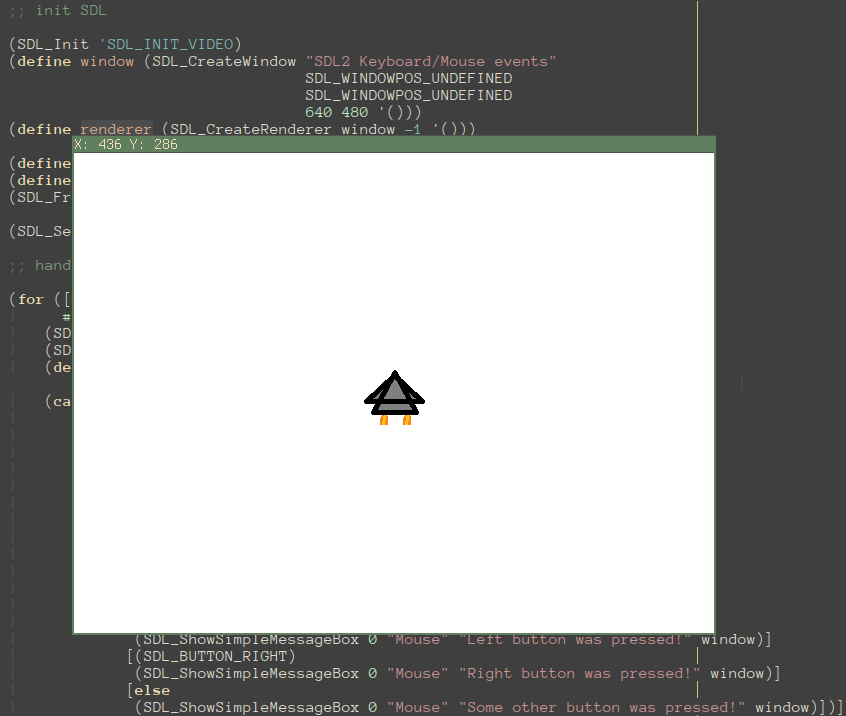

# racket-sdl2

[Racket language](https://racket-lang.org) bindings to the [Simple DirectMedia Layer 2](https://libsdl.org) library: the full package.

## Screenshots



## Features

* full power of low-level [SDL2 C API](https://wiki.libsdl.org/APIByCategory) in Racket (except some eccentric stuff like `SDL_assert`)
* includes bindings to extra SDL libraries: SDL2\_image, SDL2\_mixer, SDL2_net, SDL2\_ttf
* the entire 2.x version range is supported
* optional prettified interface that follows Scheme naming conventions (see [Usage](#usage))


## Installation

Use the [raco](https://docs.racket-lang.org/pkg/cmdline.html) package manager to install racket-sdl2:

```bash
raco pkg install sdl2
```

## Usage

Prettified interface:
```racket
#lang racket

(require
 (prefix-in sdl2: sdl2/pretty))

(sdl2:set-main-ready!)
(sdl2:init! '(video))
(define window (sdl2:create-window! "Hello, World!" 0 0 600 400 '()))
(define surface (sdl2:get-window-surface window))
(sdl2:fill-rect! surface
                 #f
                 (sdl2:map-rgb
                  (sdl2:surface-format surface)
                  0 128 255))
(sdl2:update-window-surface! window)
(sdl2:delay! 3000)
(sdl2:quit!)
```

Native interface:
```racket
#lang racket/base

(require sdl2)

(unless (zero? (SDL_Init 'SDL_INIT_VIDEO))
    (eprintf "could not initialize sdl2: ~a\n" (SDL_GetError)))

(define window (SDL_CreateWindow
                "hello_sdl2"
                SDL_WINDOWPOS_UNDEFINED
                SDL_WINDOWPOS_UNDEFINED
                640
                480
                'SDL_WINDOW_SHOWN))
(unless window
    (eprintf "could not create window: ~a\n" (SDL_GetError)))

(define screen-surface (SDL_GetWindowSurface window))
(SDL_FillRect
    screen-surface #f
    (SDL_MapRGB (SDL_Surface-format screen-surface) #xFF #xFF #xFF))
(SDL_UpdateWindowSurface window)
(SDL_Delay 2000)
(SDL_DestroyWindow window)
(SDL_Quit)
```

More examples are available in [`examples/`](https://github.com/lockie/racket-sdl2/tree/master/examples) directory.

## Related projects

* [cosmez/racket-sdl](https://github.com/cosmez/racket-sdl) - only main SDL library bindings. Contains known bugs and seems to be abandoned.
* [chicken-sdl2](http://wiki.call-cc.org/eggref/5/sdl2) - SDL2 bindings for Chicken Scheme, mostly compatible with this package's `pretty` interface.

## Contributing
Pull requests are welcome. For major changes, please open an issue first to discuss what you would like to change.

## License
[MIT](https://choosealicense.com/licenses/mit/)
